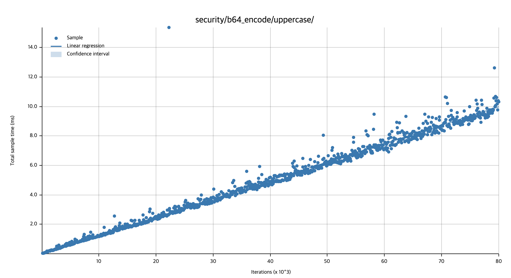
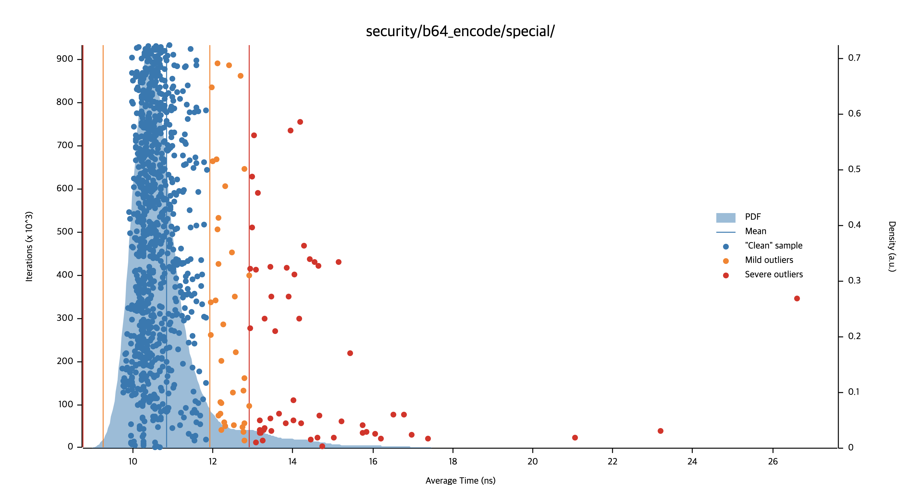
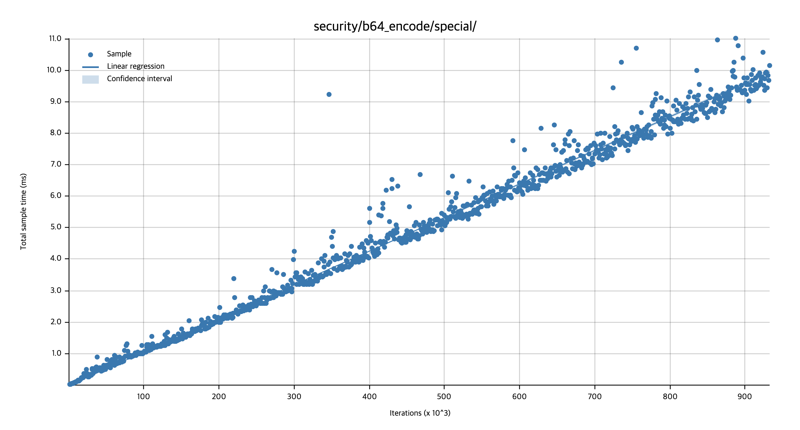
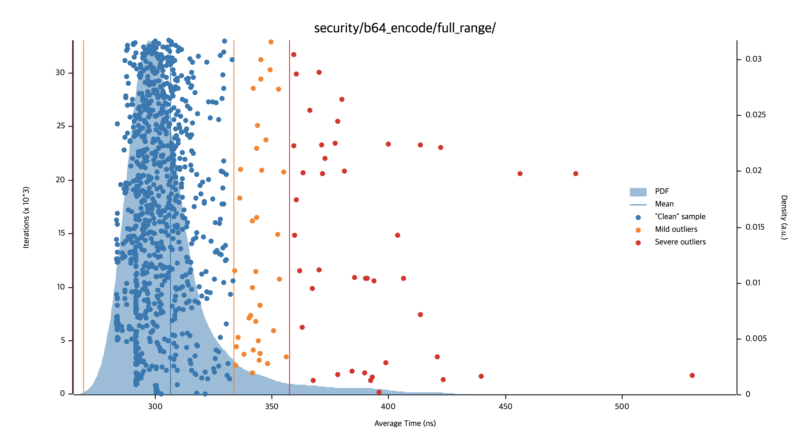
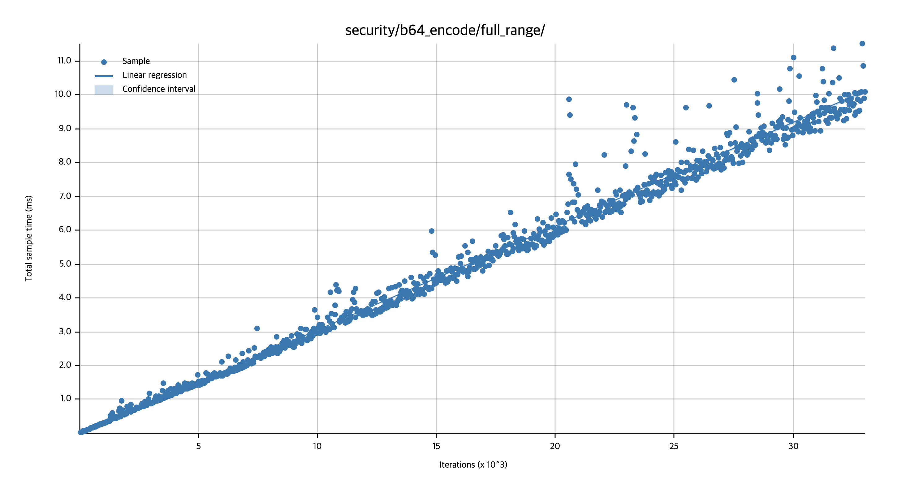

# 벤치마킹

이 네이티브 라이브러리의 벤치마킹은 `criterion` 크레이트를 통해 진행됩니다.

벤치마킹이 수행된 물리적 환경은 다음과 같습니다.

- macOS (Ventura 13.7.8(22H730))
- 2.8 GHz 쿼드 코어 Intel Core i7
- 16GB 2133 MHz LPDDR3

> [!TIP]
> `cargo criterion` 명령을 통해 벤치마크가 가능하며, 수행된 경우 `target/criterion/report` 에서 정적 프론트엔드 파일을 통해 확인 가능합니다.

벤치마킹 결과는 수행 시간을 베이스로 측정되기 떄문에 다음의 초 단위를 사용합니다.

- ms(밀리초, $`10^{-3}`$)
- μs(마이크로초, $`10^{-6}`$)
- ns(나노초, $`10^{-9}`$)
- ps(피코초, $`10^{-12}`$)

## 보안성 평가

### Base64 인코딩

Base64 인코딩은 다음 항목으로 분류됩니다.

- [`uppercase`](#uppercase)
- [`lowercase`](#lowercase)
- [`special`](#special)
- [`digit`](#digits)
- [`full_range`](#full_range)

Base64 인코딩 보안성 평가는 "문자 클래스별 타이밍 비교"를 엄밀하게 분석한 결과를 나타냅니다.

#### uppercase

| X         | 하한       | **추정**       | 상한       |
|-----------|----------|--------------|----------|
| 기울기       | 124.12ns | **124.68ns** | 125.29ns |
| 평균        | 124.59ns | **125.61ns** | 127.08ns |
| 중앙값       | 122.22ns | **122.72ns** | 123.10ns |
| 중앙값 절대 편차 | 4.5980ns | **5.2560ns** | 5.6715ns |

- 성능 변화율에 대한 $`p`$ 값이 `0.19`로 유의수준 `0.05`보다 크므로, 통계적으로 유의미한 성능 변화나 불안정성이 감지되지 않았습니다.

#### lowercase

| X         | 하한       | **추정**       | 상한       |
|-----------|----------|--------------|----------|
| 기울기       | 124.16ns | **124.71ns** | 125.29ns |
| 평균        | 124.78ns | **125.38ns** | 126.01ns |
| 중앙값       | 122.08ns | **122.38ns** | 122.71ns |
| 중앙값 절대 편차 | 4.3240ns | **4.7535ns** | 5.1551ns |

- 이전 베이스라인 대비 실행 시간이 약 `8.03%` 감소($`p < 0.05`$)하여, 통계적으로 유의미한 성능 향상이 감지되었습니다.

#### special

| X         | 하한        | **추정**       | 상한       |
|-----------|-----------|--------------|----------|
| 기울기       | 10.625ns  | **10.670ns** | 10.719ns |
| 평균        | 10.779ns  | **10.852ns** | 10.931ns |
| 중앙값       | 10.478ns  | **10.511ns** | 10.546ns |
| 중앙값 절대 편차 | 381.26ps  | **418.03ps** | 456.69ps |

> [!NOTE]
> 통계적으로 `1.7033%`의 실행 시간 증가($`p < 0.05`$)가 감지되었으나, `Criterion`은 이를 '노이즈 임계값 이내'로 판정하였으므로 
> 알고리즘 자체의 구조적 성능 저하가 아닌 **실행 환경의 기저 노이즈**로 해석됩니다.

#### digits

| X         | 하한       | **추정**       | 상한       |
|-----------|----------|--------------|----------|
| 기울기       | 48.438ns | **48.777ns** | 49.149ns |
| 평균        | 48.678ns | **48.957ns** | 49.249ns |
| 중앙값       | 47.562ns | **47.692ns** | 47.814ns |
| 중앙값 절대 편차 | 1.8361ns | **1.9722ns** | 2.1351ns |

- 성능 변화율에 대한 $`p`$ 값이 `0.29`로 유의수준 `0.05`보다 크므로, 통계적으로 유의미한 성능 변화나 불안정성이 감지되지 않았습니다.

#### full_range

| X         | 하한        | **추정**       | 상한       |
|-----------|-----------|--------------|----------|
| 기울기       | 304.85ns  | **306.31ns** | 307.86ns |
| 평균        | 305.29ns  | **306.71ns** | 308.19ns |
| 중앙값       | 300.35ns  | **300.69ns** | 301.63ns |
| 중앙값 절대 편차 | 11.0131ns | **11.698ns** | 12.478ns |

> [!NOTE]
> 통계적으로 `+0.7173%`의 미세한 시간 증가($`p < 0.05`$)가 감지되었으나, `Criterion`은 이를 '노이즈 임계값 이내'로 판정되었으므로
> 알고리즘 자체의 구조적 성능 저하가 아닌 **실행 환경의 기저 노이즈**로 해석됩니다.

#### 종합

각 결과의 추정치가 서로 큰 차이를 보이고 있습니다. **다만 이 이유는 상수-시간 연산 로직 내부의 결함으로 인해 발생한 문제가 아닙니다.**

`base64_bench.rs`는 각 문자 클래스별로 벤치마킹 루프에 전달되는 바이트 슬라이스(`Vec<u8>`)의 크기가 다릅니다. 즉, 루프 순회 오버헤드를 제외하고 바이트당 처리 시간을 산출하면 모두 균일한 속도를 보입니다.

- 대/소문자: 26바이트 배열 $\rightarrow$ 124.7ns / 26 $\approx$ `4.79ns/byte`
- 숫자: 10바이트 배열 $\rightarrow$ 48.8ns / 10 $\approx$ `4.88ns/byte`
- 특수 문자: 2바이트 배열 $\rightarrow$ 10.7ns / 2 $\approx$ `5.35ns/byte`
- 전범위: 64바이트 배열 $\rightarrow$ 306.31ns / 64 $\approx$ `4.78ns/byte`

특수 문자 배열의 크기가 2바이트로 매우 작아 반복자(iterator) 초기화 등 루프 기저 노이즈의 비중이 소폭 상승했을 뿐이지, 알고리즘 자체의 바이트당 처리 시간은 사실상 일정(constant)합니다.