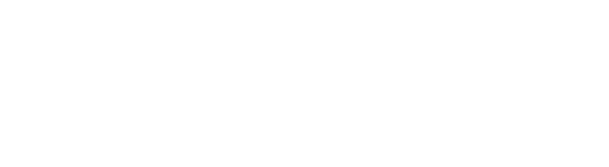

# 얽힘 라이브러리 네이티브

[얽힘 라이브러리(EntanglementLib)](https://github.com/Quant-Off/entanglementlib)의 모든 보안 기능을 책임지는 Rust 기반의 네이티브 라이브러리입니다.

> [English README](README_EN.md)

EntanglementLib의 보안 기능을 완벽히 수행하기 위한 네이티브 베이스 언어는 Rust가 가장 잘 어울립니다. 이 언어의 가장 큰 장점은 성능 저하 없이 메모리 안정성을 보장하는 거예요. 세부적으로 [소유권 개념(Ownership)](https://doc.rust-kr.org/ch04-00-understanding-ownership.html)은 자원 관리를 용이하게 하고, **데이터 경쟁 없는 동시성 기능**은 통해 멀티 스레드 환경에서도 보안성을 강화해줍니다.

Python이나 JPMS(Java Platform Module System)와 일관된 모듈 관리, 캡슐화가 간편한 등, 언어 자체가 유연한 특성을 가지고 있으며 FFI(Foreign Function Interface)로 Java와 간편히 연결되는 것은 충분히 매력으로 다가옵니다.

---

**현재로써** 이 네이티브에선 다음의 기능을 제공합니다(이 항목은 안정화 완료됐음을 의미합니다).

- `core`
  - 메모리 소거를 보장하는 보안 버퍼(Secure Buffer)
  - 상수-시간(Constant-Time) 연산
  - RNG(HashDRBG)
  - Base65, Hex 인/디코딩
- `crypto`
  - HASH(SHA-2, 3, SHAKE 포함)
  - HKDF(모든 해시 알고리즘에 대해)
  - HMAC(모든 해시 알고리즘에 대해)

각 기능은 특정 디렉토리 하위에 개별 크레이트로 분리되어 관리되고, 루트는 가상 매니페스트로 구성되어 있어 하위 크레이트를 관리하기 용이하죠. FFI를 구현한 `entlib-native-ffi` 크레이트는 Java 측에서 사용되어야 할 주요 함수를 전달하는 용도로 사용됩니다. 이러한 기능(및 잡동사니)은 `internal/`에서 관리됩니다.

## 보안 수준

얽힘 라이브러리의 Common Criteria(CC) 보안보증등급(EAL) 4를 목표로 합니다. 현재 모든 구현은 미국 국립표준기술연구소(NIST) 연방 정보 처리 표준(FIPS) 140-3 을 기준삼았고, 개별 알고리즘 구현이 만들어지거나 변경될 때 마다 CAVP 검증을 자체적으로 진행합니다.

물론 이는 정식적인 검증이 아니라 어디까지나 자체적인 평가일 뿐 입니다. CAVP에 제공되는 테스트 벡터는 단순히 '이 알고리즘은 정상적으로 작동한다'에 대한 안내일 뿐 입니다. 암호모듈 검증(CMVP)를 위해선 구현된 모든 암호 알고리즘이 정상 작동하며, FIPS 표준을 한 치의 오차도 없이 명확히 따라야 합니다.

얽힘 라이브러리의 최종 보안 목표는 CC EAL5+ 이상(EAL7)의 등급을 취득하는 것입니다. 이를 위해서는 하드웨어 레벨에서의 엄격한 설계, 정형적 명세 등의 까다롭고 복잡한 준비가 필요하지만 향후 군사급 보안에 다다를 예정입니다. 저는 이를 위한 아키텍처 설계 중에 있습니다.

## 향후 계획

지원되는 고전적 암호화 알고리즘 모듈을 다양하게 구현해야 합니다.

- AEAD
  - [ ] ChaCha20
- BlockCipher
  - [ ] AES(128, 192, 256)
  - [ ] ARIA(128, 192, 256)
- KDF
  - [ ] PBKDF2
  - [ ] Argon2id
- Digital Signature
  - [ ] RSA(2048, 4096, 8192)
  - [ ] ED25519, ED448 서명
  - [ ] X25519, X448 키 합의
- De/Serializer, En/Decoder
  - [ ] ASN.1 인/디코더
  - [ ] PEM/DER 직렬화기
- PKC Standard Pipeline
  - [ ] PKCS #8
  - [PKCS #11](https://docs.oasis-open.org/pkcs11/pkcs11-base/v2.40/os/pkcs11-base-v2.40-os.html)
    - [ ] C-API FFI 매핑
    - [ ] Dyn Loader (시스템 콜 방식)

양자-내성 암호화(Post-Quantum Cryptography, PQC) 알고리즘은 다음의 목표를 가집니다.

- [ ] [FIPS 203(Module Lattice-based Key Encapsulate Mechanism, ML-KEM)](https://csrc.nist.gov/pubs/fips/203/final)
- [X] [FIPS 204(Module Lattice-based Digital Signature Algorithm, ML-DSA)](https://csrc.nist.gov/pubs/fips/204/final)
- [ ] [FIPS 205(Stateless Hash-based Digital Signature Algorithm, SLH-DSA)](https://csrc.nist.gov/pubs/fips/205/final)

그리고 다음의 TLS 기능도 제공되어야 합니다.

- [ ] TLS 1.3
- [ ] [`draft-ietf-tls-ecdhe-mlkem`](https://datatracker.ietf.org/doc/draft-ietf-tls-ecdhe-mlkem/)에 따른 X25519MLKEM768
- [ ] X9.146 QTLS 확장 표준

## 인증 및 규정 준수 필요

앞서 언급한 인증 및 규정 준수(컴플라이언스) 사항을 완벽히 지켜내기 위해 암호 알고리즘은 계속해서 검증되고, 얽힘 라이브러리 자체의 FIPS 표준 또한 점검됩니다. CAVP에 대한 구체적인 진행 상황은 다른 문서에 기록하겠습니다.

따라서 `entlib-naitve`를 사용하신다면 반드시 '살험적(experimental)' 기능으로 제공하거나, 사용하시길 바랍니다.

> [!NOTE]
> 엄격한 인증 및 규정 심사를 통과한 기능은 즉각적으로 업데이트히겠습니다. [이 문서](COMPLIANCE.md)에서 해당 정보를 확인할 수 있도록 하겠습니다. 

# 기여

제가 정말 좋아하는 보안 단체인 `Legion of the BouncyCastle Inc`는 [`bc-rust`](https://github.com/bcgit/bc-rust/) 개발을 시작했고 여기서 암호 알고리즘이나 키 관리 방식 등 유용한 기술적 영감을 많이 얻었습니다. 이들은 제가 얽힘 라이브러리 개발을 시작했을 때 부터 지금까지 언제나 저의 힘이 되어주고 있습니다. 어쨌든 저는 이 개발 속도(주 7일 10시간, 하지만 커밋은 느린.)를 유지할 것이며, 향후 업데이트에 따라 이 문서를 지속적으로 수정하겠습니다. 결국 이 목표를 향해 쭉 개발할 예정입니다.

> [!TIP]
> 여러분의 피드백은 언제나 아주 큰 힘이 됩니다. 이 프로젝트에 기여하고자 한다면 이슈 또는 [기여 문서](CONTRIBUTION.md)를 참고해주세요!