# Base64 Benchmark

> [이 벤치마킹은 어떻게 수행되나요?](README.md)

## 보안성 평가

### Base64 인코딩

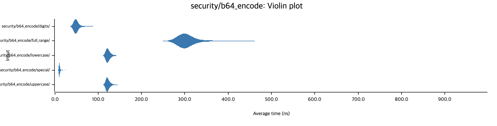

Base64 인코딩 보안성 평가는 다음 항목으로 분류됩니다.

- [`uppercase`](#uppercase)
- [`lowercase`](#lowercase)
- [`special`](#special)
- [`digit`](#digits)
- [`full_range`](#full_range)
- [`종합`](#종합)

Base64 인코딩 보안성 평가는 "문자 클래스별 타이밍 비교"를 엄밀하게 분석한 결과를 나타냅니다.

#### uppercase

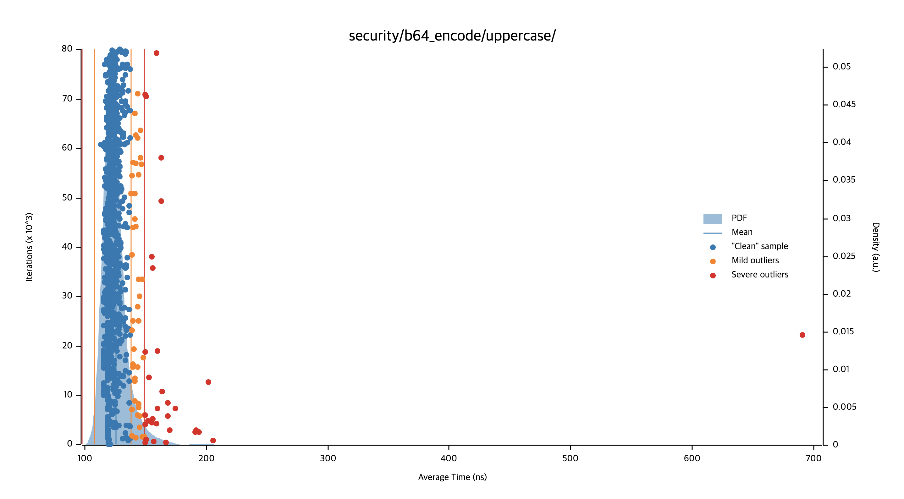

| X         | 하한       | **추정**       | 상한       |
|-----------|----------|--------------|----------|
| 기울기       | 124.12ns | **124.68ns** | 125.29ns |
| 평균        | 124.59ns | **125.61ns** | 127.08ns |
| 중앙값       | 122.22ns | **122.72ns** | 123.10ns |
| 중앙값 절대 편차 | 4.5980ns | **5.2560ns** | 5.6715ns |

- 이전 베이스라인 대비 통계적으로 유의미한 성능 변화나 불안정성이 감지되지 않았습니다.

#### lowercase

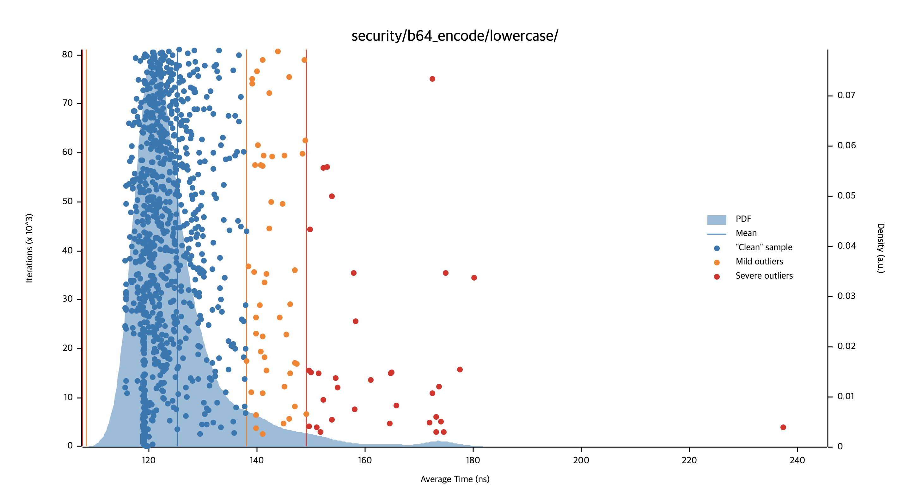
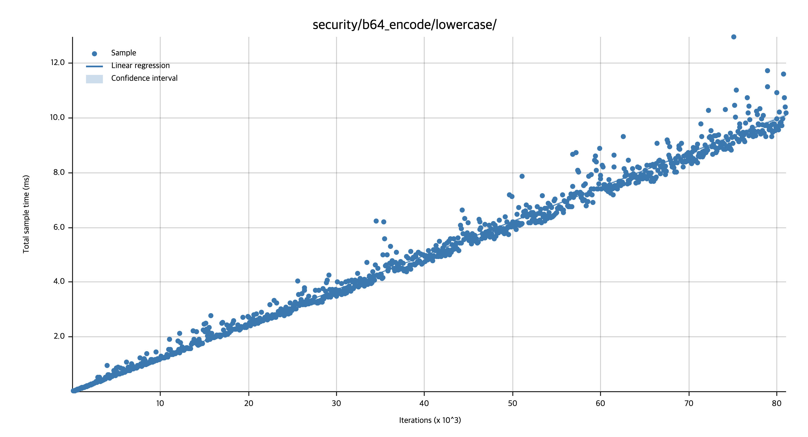

| X         | 하한       | **추정**       | 상한       |
|-----------|----------|--------------|----------|
| 기울기       | 124.16ns | **124.71ns** | 125.29ns |
| 평균        | 124.78ns | **125.38ns** | 126.01ns |
| 중앙값       | 122.08ns | **122.38ns** | 122.71ns |
| 중앙값 절대 편차 | 4.3240ns | **4.7535ns** | 5.1551ns |

- 이전 베이스라인 대비 실행 시간이 약 `8.03%` 감소($`p < 0.05`$)하여, 통계적으로 유의미한 성능 향상이 감지되었습니다.

#### special

| X         | 하한        | **추정**       | 상한       |
|-----------|-----------|--------------|----------|
| 기울기       | 10.625ns  | **10.670ns** | 10.719ns |
| 평균        | 10.779ns  | **10.852ns** | 10.931ns |
| 중앙값       | 10.478ns  | **10.511ns** | 10.546ns |
| 중앙값 절대 편차 | 381.26ps  | **418.03ps** | 456.69ps |

> [!NOTE]
> 통계적으로 `1.7033%`의 실행 시간 증가($`p < 0.05`$)가 감지되었으나, `Criterion`은 이를 '노이즈 임계값 이내'로 판정하였으므로
> 알고리즘 자체의 구조적 성능 저하가 아닌 **실행 환경의 기저 노이즈**로 해석됩니다.

#### digits

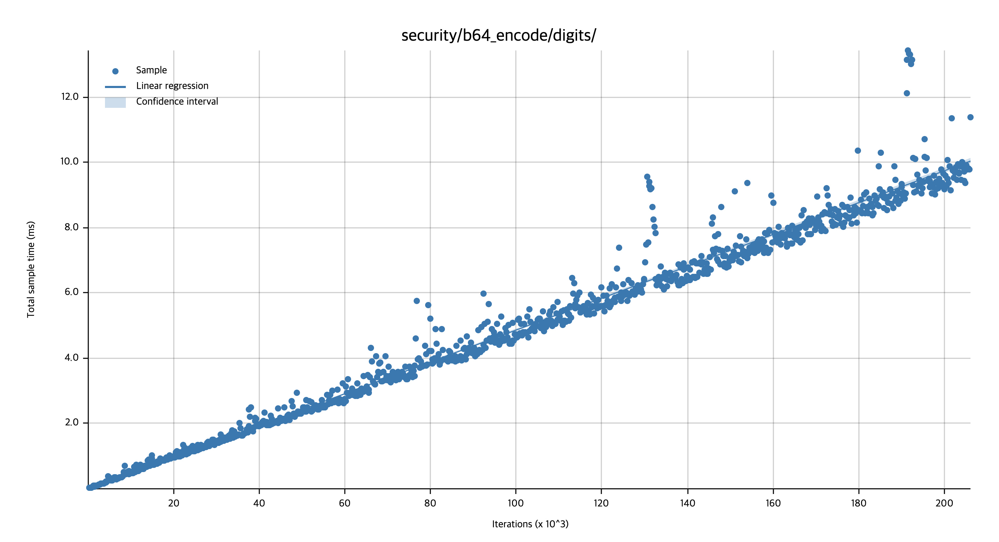

| X         | 하한       | **추정**       | 상한       |
|-----------|----------|--------------|----------|
| 기울기       | 48.438ns | **48.777ns** | 49.149ns |
| 평균        | 48.678ns | **48.957ns** | 49.249ns |
| 중앙값       | 47.562ns | **47.692ns** | 47.814ns |
| 중앙값 절대 편차 | 1.8361ns | **1.9722ns** | 2.1351ns |

- 이전 베이스라인 대비 통계적으로 유의미한 성능 변화나 불안정성이 감지되지 않았습니다.

#### full_range

| X         | 하한        | **추정**       | 상한       |
|-----------|-----------|--------------|----------|
| 기울기       | 304.85ns  | **306.31ns** | 307.86ns |
| 평균        | 305.29ns  | **306.71ns** | 308.19ns |
| 중앙값       | 300.35ns  | **300.69ns** | 301.63ns |
| 중앙값 절대 편차 | 11.0131ns | **11.698ns** | 12.478ns |

> [!NOTE]
> 통계적으로 `+0.7173%`의 미세한 시간 증가($`p < 0.05`$)가 감지되었으나, `Criterion`은 이를 '노이즈 임계값 이내'로 판정되었으므로
> 알고리즘 자체의 구조적 성능 저하가 아닌 **실행 환경의 기저 노이즈**로 해석됩니다.

#### 종합

> [!IMPORTANT]
> 각 결과의 추정치가 서로 큰 차이를 보이고 있습니다. **다만 이 이유는 상수-시간 연산 로직 내부의 결함으로 인해 발생한 문제가 아닙니다.**

`base64_bench.rs`는 각 문자 클래스별로 벤치마킹 루프에 전달되는 바이트 슬라이스(`Vec<u8>`)의 크기가 다릅니다. 즉, **루프 순회 오버헤드를 제외하고 바이트당 처리 시간을 산출하면 모두 균일한 속도**를 보입니다.

- 대/소문자: 26바이트 배열 $\rightarrow$ 124.7ns / 26 $\approx$ `4.79ns/byte`
- 숫자: 10바이트 배열 $\rightarrow$ 48.8ns / 10 $\approx$ `4.88ns/byte`
- 특수 문자: 2바이트 배열 $\rightarrow$ 10.7ns / 2 $\approx$ `5.35ns/byte`
- 전범위: 64바이트 배열 $\rightarrow$ 306.31ns / 64 $\approx$ `4.78ns/byte`

특수 문자 배열의 크기가 2바이트로 매우 작아 반복자(iterator) 초기화 등 루프 기저 노이즈의 비중이 소폭 상승했을 뿐이지, 알고리즘 자체의 바이트당 처리 시간은 사실상 일정(constant)합니다.

### Base64 디코딩

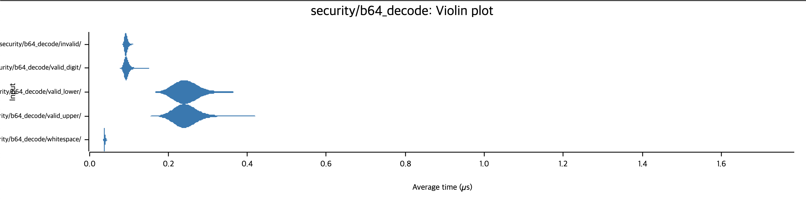

Base64 디코딩 보안성 평가는 다음 항목으로 분류됩니다.

- [`valid_upper`](#valid_upper)
- [`valid_lower`](#valid_lower)
- [`valid_digit`](#valid_digit)
- [`whitespace`](#whitespace)
- [`invalid`](#invalid)
- [`종합`](#종합-1)

Base64 디코딩 보안성 평가는 "입력 클래스별 타이밍 비교"를 엄밀하게 분석한 결과를 나타냅니다.

#### valid_upper

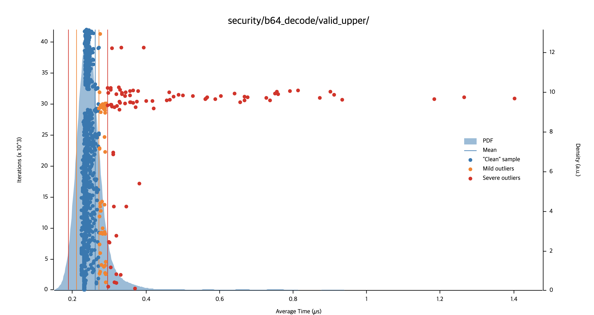
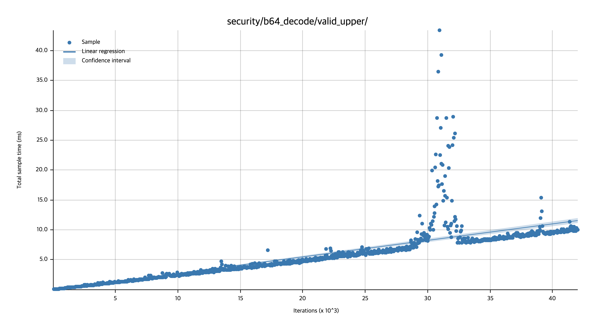

| X         | 하한       | **추정**       | 상한       |
|-----------|----------|--------------|----------|
| 기울기       | 253.46ns | **255.37ns** | 257.56ns |
| 평균        | 264.13ns | **272.45ns** | 283.96ns |
| 중앙값       | 249.61ns | **251.30ns** | 252.89ns |
| 중앙값 절대 편차 | 15.731ns | **17.612ns** | 19.228ns |

- 이전 베이스라인 대비 통계적으로 유의미한 성능 변화나 불안정성이 감지되지 않았습니다.

#### valid_lower

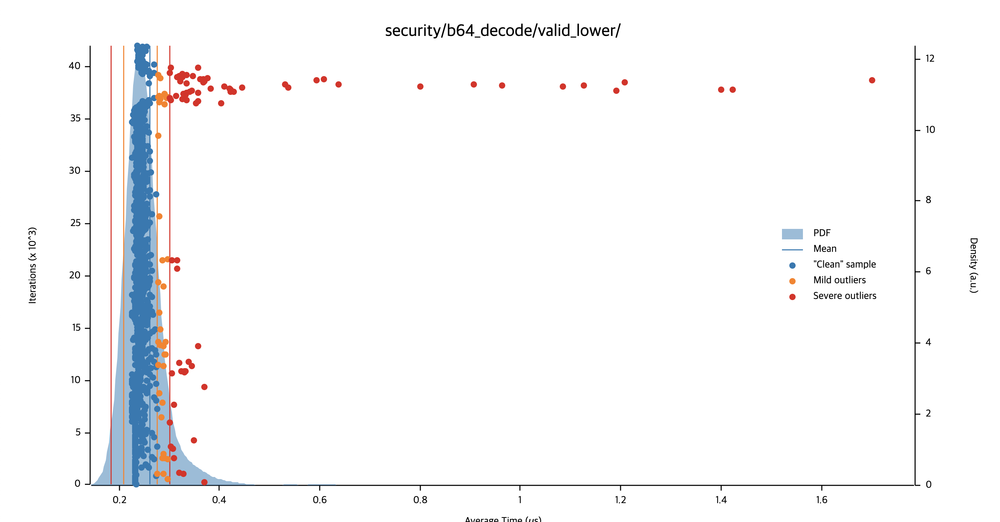
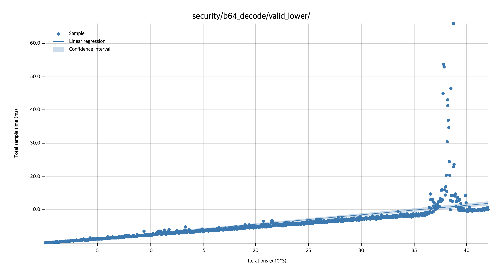

| X         | 하한       | **추정**       | 상한       |
|-----------|----------|--------------|----------|
| 기울기       | 255.30ns | **258.16ns** | 261.26ns |
| 평균        | 252.23ns | **253.88ns** | 255.63ns |
| 중앙값       | 244.45ns | **245.46ns** | 246.78ns |
| 중앙값 절대 편차 | 13.392ns | **14.740ns** | 16.579ns |

- 이전 베이스라인 대비 통계적으로 유의미한 성능 변화나 불안정성이 감지되지 않았습니다.

#### valid_digit

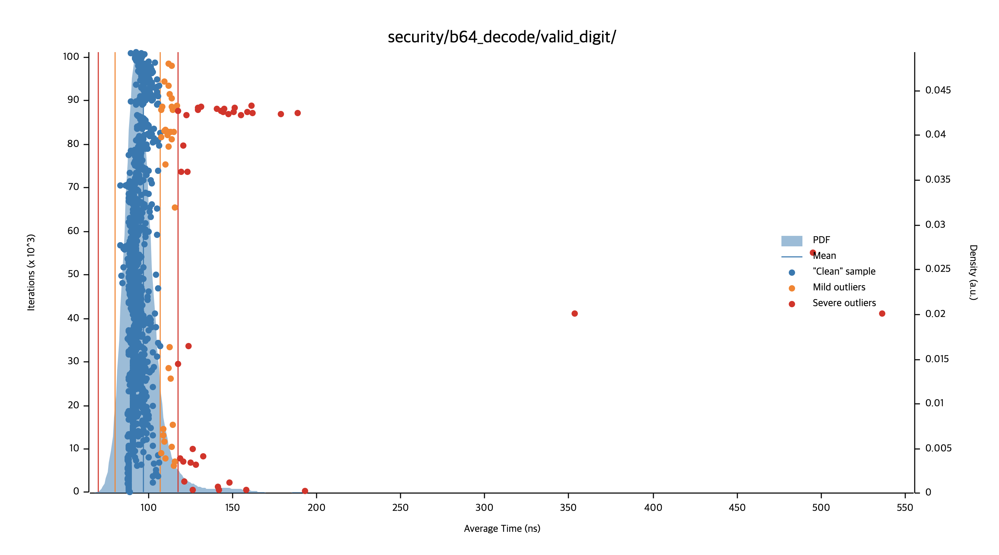

| X         | 하한       | **추정**       | 상한       |
|-----------|----------|--------------|----------|
| 기울기       | 97.760ns | **99.057ns** | 100.52ns |
| 평균        | 95.864ns | **97.136ns** | 98.700ns |
| 중앙값       | 92.983ns | **93.478ns** | 93.889ns |
| 중앙값 절대 편차 | 4.1934ns | **4.4707ns** | 4.8912ns |

- 이전 베이스라인 대비 통계적으로 유의미한 성능 변화나 불안정성이 감지되지 않았습니다.

#### whitespace

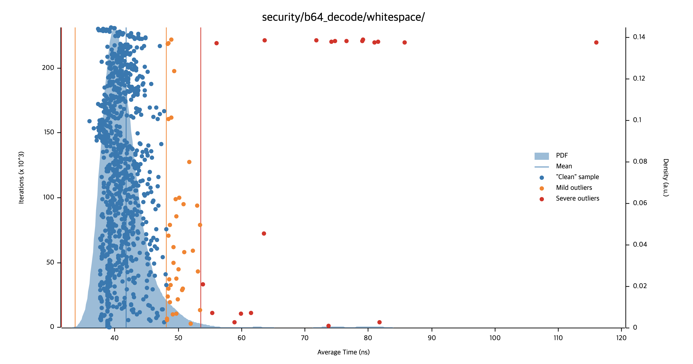

| X         | 하한       | **추정**       | 상한       |
|-----------|----------|--------------|----------|
| 기울기       | 41.637ns | **42.321ns** | 43.111ns |
| 평균        | 41.486ns | **41.811ns** | 42.173ns |
| 중앙값       | 40.457ns | **40.690ns** | 40.840ns |
| 중앙값 절대 편차 | 2.3001ns | **2.5639ns** | 2.7156ns |

> [!WARNING]
> 이전 베이스라인 대비 실행 시간이 약 `6.17%` 증가함에 따라 **로직 수정 후 재시도가 필요합니다.**

#### invalid

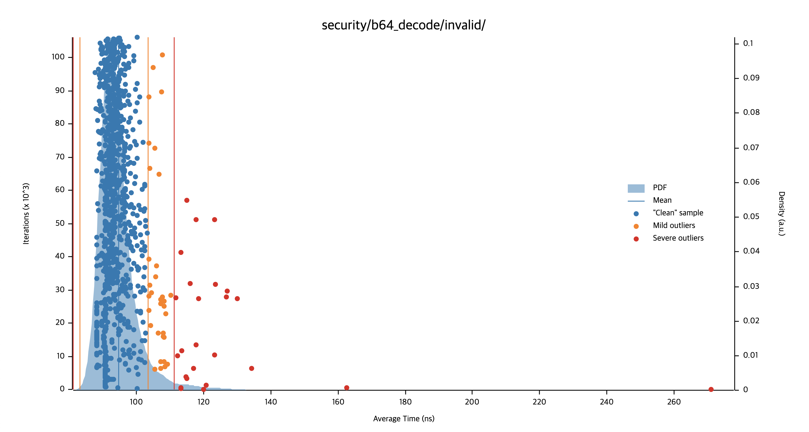
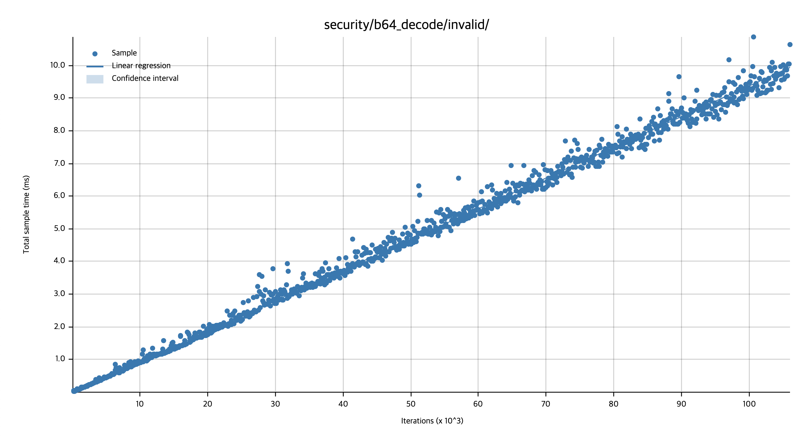

| X         | 하한       | **추정**       | 상한       |
|-----------|----------|--------------|----------|
| 기울기       | 93.534ns | **93.795ns** | 94.067ns |
| 평균        | 94.135ns | **94.596ns** | 95.149ns |
| 중앙값       | 92.852ns | **93.039ns** | 93.276ns |
| 중앙값 절대 편차 | 3.1998ns | **3.4684ns** | 3.7698ns |

- 성능 변화율에 대한 $`p`$ 값이 `0.82`로 유의수준 `0.05`보다 크므로, 통계적으로 유의미한 성능 변화나 불안정성이 감지되지 않았습니다.

#### 종합

> [!IMPORTANT]
> 각 결과의 추정치가 서로 큰 차이를 보이고 있습니다. **다만 이 이유는 상수-시간 연산 로직 내부의 결함으로 인해 발생한 문제가 아닙니다.**

[Base64 인코딩 보안성 평가 종합](#종합)에서와 동일하게 벤치마크에 사용된 입력 배열의 길이를 기준으로 바이트당 평균 처리 시간을 산출하면 알고리즘의 일관성을 확인할 수 있습니다.

- 대문자 유효성: 26바이트 배열 $\rightarrow$ 255.37ns / 26 $\approx$ `9.82ns/byte`
- 소문자 유효성: 26바이트 배열 $\rightarrow$ 258.16ns / 26 $\approx$ `9.92ns/byte`
- 숫자 유효성: 10바이트 배열 $\rightarrow$ 99.057ns / 10 $\approx$ `9.90ns/byte`
- 공백: 4바이트 배열 $\rightarrow$ 42.321ns / 4 $\approx$ `10.58ns/byte`

이는 타이밍 부채널 공격 방어 기제가 모든 문자 클래스에 대해 완벽하게 작동하고 있음을 증명합니다.

더 깊게 논의할 필요가 있어 보입니다. 이 시도에서, 전체적인 **성능이 소폭 저하**되어 보입니다. 우리는 다음 세 가지 구조적 요인을 생각해볼 수 있습니다.

- 다중 마스킹 연산의 중첩 (비용 증가)
  - 이전 디코딩 로직을 살펴보면 공백 문자를 처리하기 위해 `b.ct_eq(b' ') | b.ct_eq(b'\t') | b.ct_eq(b'\r') | b.ct_eq(b'\n')`와 같이 총 4번의 상수-시간 동등 비교 연산과 3번의 비트 논리합(OR) 연산이 수행됩니다. 이러한 복잡한 마스크(`mask_ws`) 계산이 파이프라인에 추가되면서 베이스라인 대비 절대적인 연산 사이클이 증가한 것입니다.

- 조기 반환(Early-return)의 원천 차단
  - 보안이 취약한 일반적인 `Base64` 디코더는 유효하지 않은 문자나 공백을 만나는 즉시 분기문을 통해 루프를 탈출하거나 무시합니다. 하지만 현재 구현된 네이티브 로직은 최고 수준의 메모리 접근 독립성을 보장하기 위해 입력값이 무엇이든 모든 범위 검사와 `ct_select` 연산을 끝까지 수행합니다. 이 `1~4%`의 시간 증가는 조건 분기를 없애 분기 예측(branch prediction) 공격을 무력화하기 위해 지불한 필수적인 '보안 보험료'입니다.

- 배열 크기에 따른 기저 노이즈 증폭
  - `whitespace` 배열의 크기는 단 4바이트에 불과합니다. 마이크로 벤치마킹 환경에서 입력 크기가 이처럼 극단적으로 작으면, 루프 오버헤드나 캐시 초기화 등 시스템 기저 노이즈가 전체 측정 시간(약 `42ns`)에서 차지하는 비중이 커집니다. 따라서 실제 연산량 증가분보다 퍼센트 수치가 다소 과장되어 나타나는 경향이 있습니다.

**결론적으로,** 이는 시스템의 전체적인 대역폭을 저해할 수준의 병목은 아닙니다만, 안전한 연산을 빠르게 수행할 수 있도록 로직을 수정한 후 반복 시도해보겠습니다.

## 처리량 평가 (범위)

### Base64 인코딩 (0..64 전범위)

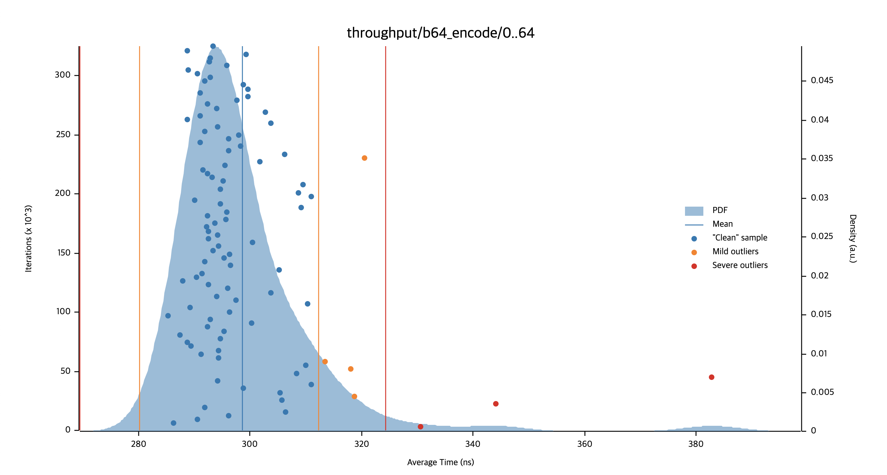
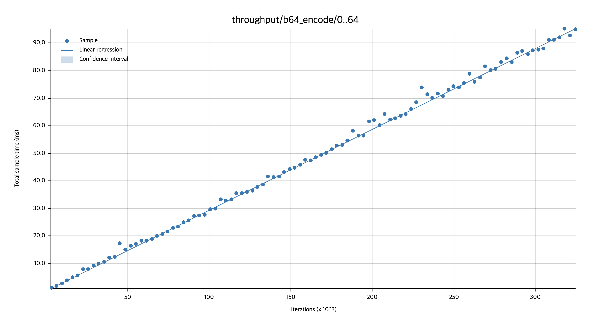

| X         | 하한            | **추정**            | 상한            |
|-----------|---------------|-------------------|---------------|
| 기울기       | 285.21ns      | **287.41ns**      | 289.82ns      |
| **처리량**   | 220.83Melem/s | **222.68Melem/s** | 224.39Melem/s |
| 평균        | 289.40ns      | **291.48ns**      | 293.72ns      |
| 중앙값       | 287.80ns      | **289.58ns**      | 291.50ns      |
| 중앙값 절대 편차 | 5.9142ns      | **7.8304ns**      | 9.9300ns      |

- 이전 베이스라인 대비 성능에 큰 변화는 없었습니다.

### Base64 디코딩 (0..255 전범위)

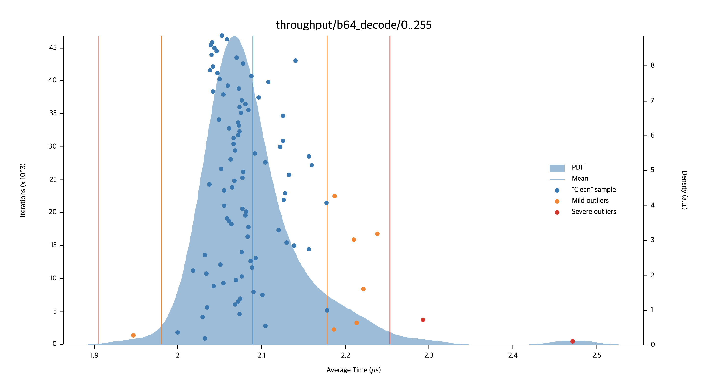
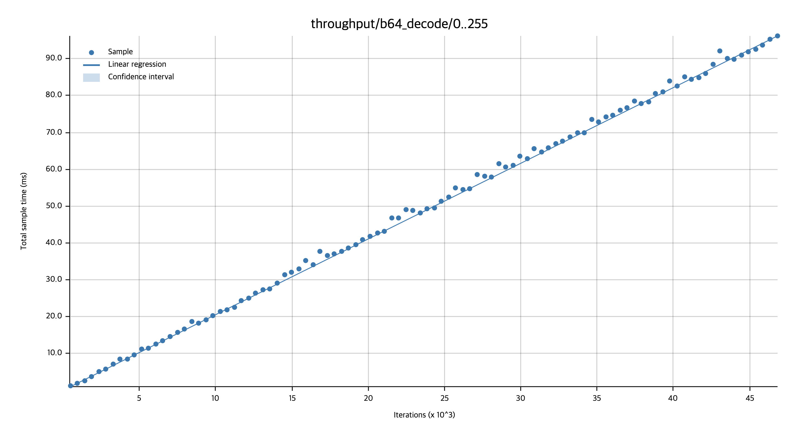

| X         | 하한            | **추정**            | 상한            |
|-----------|---------------|-------------------|---------------|
| 기울기       | 2.1621µs      | **2.1928µs**      | 2.2236µs      |
| **처리량**   | 115.13Melem/s | **116.74Melem/s** | 118.40Melem/s |
| 평균        | 2.1450µs      | **2.1668µs**      | 2.1894µs      |
| 중앙값       | 2.1189µs      | **2.1541µs**      | 2.1766µs      |
| 중앙값 절대 편차 | 86.103ns      | **110.08ns**      | 143.25ns      |

- 이전 베이스라인 대비 실행 시간이 약 `2.72%` 감소($`p < 0.05`$)하여, 통계적으로 유의미한 성능 향상이 감지되었습니다.

### 종합

> [!IMPORTANT]
> **디코딩 처리량**이 인코딩 처리량보다 다소 낮게 측정되었습니다. **다만 이것은 알고리즘의 구조적 특성상 필연적이며, 오히려 강력한 보안성을 반증하는 결과**입니다.

이에 우리는 다음 두 가지 명확한 근거(특징)를 제시할 수 있습니다.

1. **연산 파이프라인의 길이 차이**
   - 디코딩 연산은 대소문자 및 숫자뿐만 아니라 더하기 기호(`+)`, 슬래시(`/`), 패딩(`=`), 그리고 각종 공백 문자(스페이스, 탭, 줄바꿈 등)까지 총 7개 이상의 마스크를 계산하고 검증해야 합니다. 이로 인해 인코딩 대비 상수-시간 비트 논리 연산의 횟수가 증가하여 바이트당 처리 시간이 약 `3.5ns` 더 소요된 것입니다.
2. **타이밍 부채널 공격 무력화**
   - 가장 주목해야 할 점은 디코딩 벤치마크에 유효하지 않은 문자(invalid characters)와 공백 문자 범위가 대거 포함(0..255)되어 있음에도 불구하고 실행 시간이 완전히 선형적이라는 것입니다.
   - 일반적인 구현체라면 유효하지 않은 문자를 마주칠 경우 조기 반환(early exit)을 수행하여 실행 시간이 들쭉날쭉해집니다.
     - 하지만 현재 구현체는 입력값이 **유효**하든, **패딩**이든, **악의적인 쓰레기 값**이든 관계없이 동일한 양의 비트 마스킹을 수행하여 상수-시간 완전성을 유지합니다. 공격자가 조작된 암호문을 주입하여 파싱 시간을 재는 패딩 오라클 공격(padding oracle attack)이나 에러 타이밍 분석을 시도하더라도 **어떠한 정보도 얻을 수 없습니다.**

## 처리량 평가 (용량)

### Base64 인코딩 (16KiB)

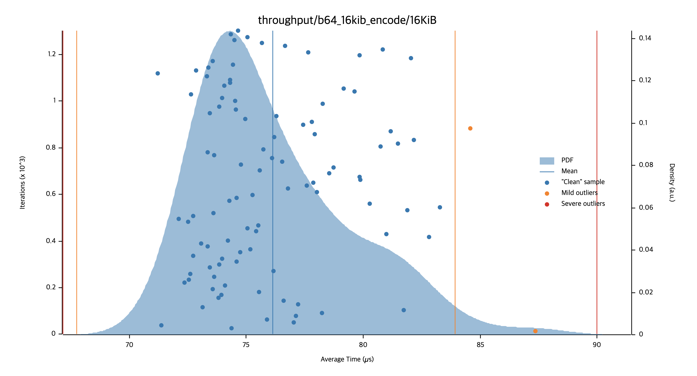
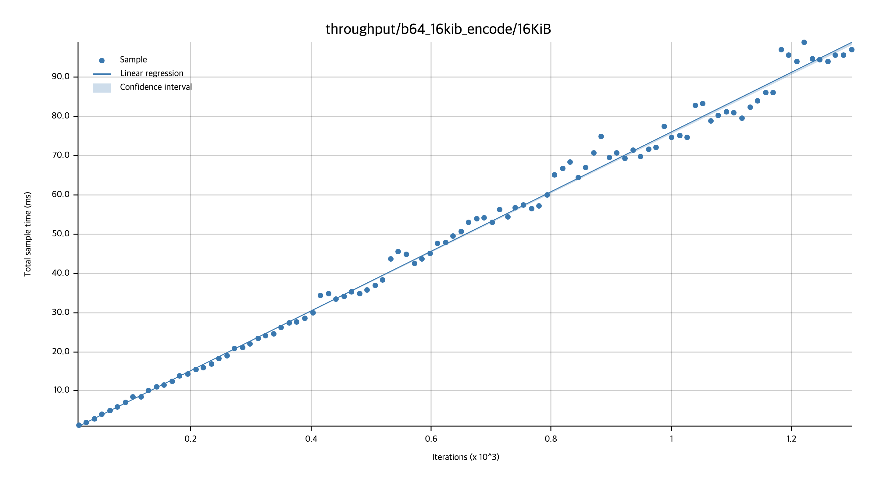

| X         | 하한          | **추정**          | 상한          |
|-----------|-------------|-----------------|-------------|
| 기울기       | 75.483µs    | **76.217µs**    | 76.993µs    |
| **처리량**   | 202.94MiB/s | **205.01MiB/s** | 207.00MiB/s |
| 평균        | 75.528µs    | **76.140µs**    | 76.782µs    |
| 중앙값       | 74.514µs    | **75.111µs**    | 76.091µs    |
| 중앙값 절대 편차 | 1.7689µs    | **2.5407µs**    | 3.3973µs    |

- 이전 베이스라인 대비 실행 시간이 `6.79%` 감소, 처리량이 `7.28%` 증가하여($`p < 0.05`$), 통계적으로 유의미한 성능 향상이 감지되었습니다.

### Base64 디코딩 (16KiB)

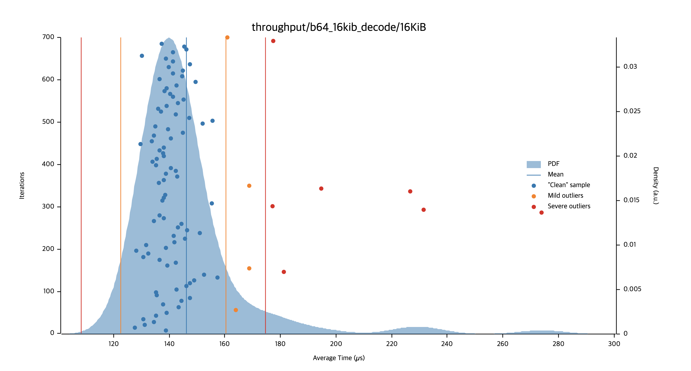
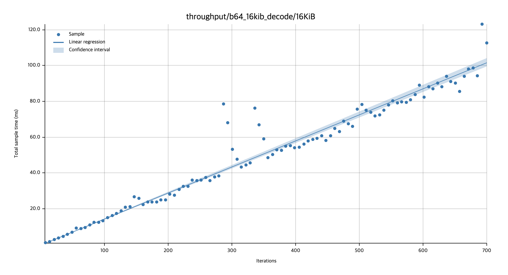

| X         | 하한          | **추정**          | 상한          |
|-----------|-------------|-----------------|-------------|
| 기울기       | 136.20µs    | **137.62µs**    | 139.10µs    |
| **처리량**   | 112.33MiB/s | **113.53MiB/s** | 114.72MiB/s |
| 평균        | 140.96µs    | **144.36µs**    | 148.41µs    |
| 중앙값       | 137.92µs    | **138.98µs**    | 141.86µs    |
| 중앙값 절대 편차 | 4.9468µs    | **6.1104µs**    | 8.5349µs    |

- 이전 베이스라인 대비 성능에 큰 변화는 없었습니다.

### 종합

인코딩은 성능 저하가 거의 발생하지 않았고, 디코딩은 소규모 벤치마킹 때와 비슷한 결과를 보여 **대용량 페이로드 확장성에 용이함이** 보입니다.

실행 시간이 `µs` 단위로 진입함에 따라 확률 밀도 함수(Probability Density Function, PDF) 그래프의 우측 꼬리(heavy-tail)에 심각한 이상치(severe outliers)가 다소 흩어져 나타나고 있습니다. **그러나 이는 연산 자체의 불안정성이 아니라, 수십 마이크로초 동안 스레드가 CPU를 점유하면서 발생하는 운영체제 스케줄러의 컨텍스트 스위칭이나 `interrupt` 처리 등 시스템 레벨의 기저 노이즈**입니다. 전체 데이터의 분포(밀도 함수의 형태)는 여전히 중앙값 부근에 안정적으로 군집되어 있습니다.

일반적으로 `16KiB` 크기의 임의의 데이터를 처리할 때 LUT(Look-up Table)을 사용하는 전통적인 알고리즘은 CPU의 `L1/L2` 캐시 적중률(cache hit rate)에 따라 **연산 시간의 편차가 크게 발생**합니다.

제공된 linear regression 시각화 자료를 보면, 인코딩과 디코딩 모두 반복 횟수 증가에 따라 데이터 포인트들이 매우 좁은 신뢰 구간 내에서 직선형으로 분포하고 있습니다. 이는 메모리 배열 참조 대신 산술 및 비트 논리 연산만으로 `ASCII` 값을 계산하는 현재의 아키텍처가 메모리 접근 패턴의 무작위성을 배제했기 때문입니다. 결과적으로 캐시 미스에 의한 지연 스파이크(latency spike)가 발생하지 않아 **결정론적인 실행 시간을 보장**합니다.