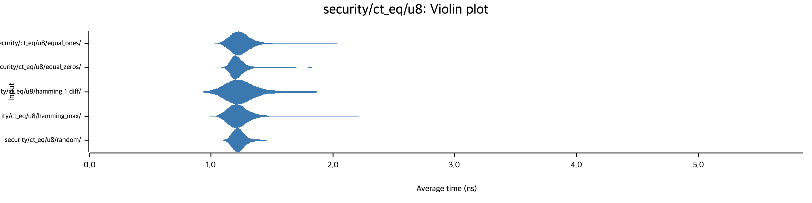
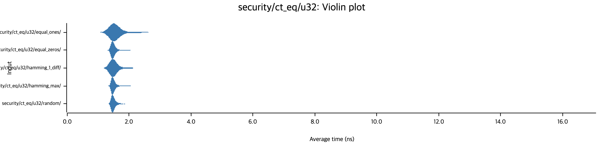
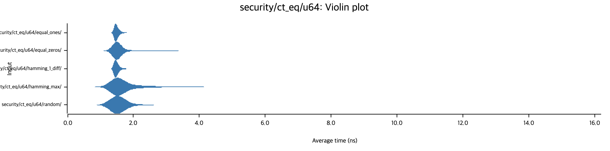
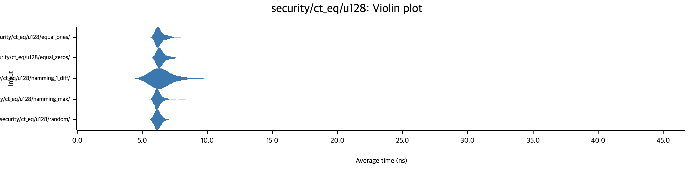

# Constant-Time Benchmark

> [이 벤치마킹은 어떻게 수행되나요?](README.md)

## 보안성 평가

상수-시간(Constant-Time, CT) 연산의 보안성 평가는 `constant_time.rs`의 각 함수에 대해 진행됩니다. 모든 함수는 `u8`, `u32`, `u64`, `u128` 타입에 대해 수행되었습니다.

- [`ct_eq`](#ct_eq)
- [`ct_is_negative`](#ct_is_negative)
- [`ct_is_nonzero`](#ct_is_nonzero)
- [`ct_is_zero`](#ct_is_zero)
- [`ct_ne`](#ct_ne)
- [`ct_select`](#ct_select)

Base64 인코딩 보안성 평가는 "문자 클래스별 타이밍 비교"를 엄밀하게 분석한 결과를 나타냅니다.

> [!NOTE]
> 이 벤치마킹이 수행되는 환경은 `x86_64` 아키텍처이며 이는 Tier 1(full ASM), 2(barrier)에 해당됩니다. 인라인 어셈블리 로직으로 인해 `aarch64` 환경에서의 벤치마킹이 추가적으로 필요하며, 이 작업을 완료하면 아키텍처별로 문서를 나누어 정리하겠습니다.

이 벤치마킹의 결과를 정리함에 있어 다중 베이스라인에 대한 비교치를 포함하지 않겠습니다. 상수-시간 연산에는 크게 의미 없는 수치이기 떄문입니다. 또한, 결과 표에는 검사 내용의 추정치만을 기록하겠습니다. **단위 확인에 유의하세요.**

### ct_eq

이 함수에서 개별 타입에 대한 검사 항목은 다음과 같습니다.

- `equal_ones`
- `equal_zeros`
- `hamming_1_diff`
- `hamming_max`
- `random`

#### u8

| 함수               |   기울기    |    평균    |   중앙값    | 중앙값 절대 편차 |
|------------------|:--------:|:--------:|:--------:|:---------:|
| `equal_ones`     | 1.2367ns | 1.3136ns | 1.2319ns | 50.322ps  |
| `equal_zeros`    | 1.2238ns | 1.2330ns | 1.2114ns | 42.458ps  |
| `hamming_1_diff` | 1.3581ns | 1.3211ns | 1.2210ns | 55.625ps  |
| `hamming_max`    | 1.3556ns | 1.2787ns | 1.2154ns | 50.333ps  |
| `random`         | 1.2334ns | 1.2533ns | 1.2246ns | 41.258ps  |

#### u32

| 함수               |   기울기    |    평균    |   중앙값    | 중앙값 절대 편차 |
|------------------|:--------:|:--------:|:--------:|:---------:|
| `equal_ones`     | 1.5142ns | 1.6185ns | 1.5130ns | 71.710ps  |
| `equal_zeros`    | 1.5007ns | 1.5167ns | 1.4814ns | 52.763ps  |
| `hamming_1_diff` | 1.6970ns | 1.5848ns | 1.4877ns | 62.003ps  |
| `hamming_max`    | 1.4963ns | 1.5180ns | 1.4858ns | 58.120ps  |
| `random`         | 1.5075ns | 1.5161ns | 1.4886ns | 61.396ps  |

#### u64

| 함수               |   기울기    |    평균    |   중앙값    | 중앙값 절대 편차 |
|------------------|:--------:|:--------:|:--------:|:---------:|
| `equal_ones`     | 1.4959ns | 1.5097ns | 1.4782ns | 55.508ps  |
| `equal_zeros`    | 1.6809ns | 1.6181ns | 1.4948ns | 70.550ps  |
| `hamming_1_diff` | 1.5004ns | 1.5059ns | 1.4717ns | 61.653ps  |
| `hamming_max`    | 1.5795ns | 1.7985ns | 1.5303ns | 108.93ps  |
| `random`         | 1.8837ns | 1.6573ns | 1.5150ns | 101.51ps  |

#### u128

| 함수               |   기울기    |    평균    |   중앙값    | 중앙값 절대 편차 |
|------------------|:--------:|:--------:|:--------:|:---------:|
| `equal_ones`     | 6.3781ns | 6.4470ns | 6.2735ns | 261.01ps  |
| `equal_zeros`    | 6.3915ns | 6.5176ns | 6.3836ns | 271.79ps  |
| `hamming_1_diff` | 6.7002ns | 6.8767ns | 6.2641ns | 284.01ps  |
| `hamming_max`    | 6.2321ns | 6.2935ns | 6.1827ns | 231.66ps  |
| `random`         | 6.2785ns | 6.3071ns | 6.1993ns | 231.12ps  |

#### 종합

**모든 데이터 타입에서 상수 시간 특성이 강력하게 유지되고 있습니다.**

입력값의 특성(모두 같음, 비트 하나 다름, 완전히 다름 등)에 따른 실행 시간의 편차(variance)가 극히 미미하며, 이는 양자-내성 암호(Post-Quantum Cryptography, PQC) 구현에 필수적인 보안 요구사항을 충족합니다. 티어별 다음의 결과로 나타낼 수 있습니다.

- Tier 1(Full ASM, `u32`/`u64`)
  - 아키텍처별 어셈블리 명령어를 직접 사용하여 가장 안정적인 타이밍을 보입니다.
- Tier 2(Barrier + Rust Logic, `u8`/`u128`)
  - 컴파일러 최적화 방지 배리어(`ct_fence`)와 비트 연산을 조합한 방식으로, 순수 ASM보다는 오버헤드가 있으나 여전히 훌륭한 상수 시간성을 보장합니다.

`u128`은 네이티브 레지스터 크기를 초과하므로, 소스 코드에서 두 개의 `u64`로 분할하여 처리합니다. 이 데이터 타입에서 `u64`($`\approx 1.5\text{ns}`$) 대비 약 4배 느린 $`\approx 6.3\text{ns}`$를 기록했습니다. 이는 단순히 두 번 연산하는 것을 넘어, 상위/하위 비트 분할, 별도의 `ct_fence` 호출, 그리고 어셈블리가 아닌 Rust 로직(`impl_ct_rust_ops!`)을 타기 때문에 발생하는 오버헤드입니다.

안정성 측면에서 절대적인 시간은 길어졌으나, `equal_zeros`($6.38\text{ns}$)와 `hamming_max`($6.18\text{ns}$)의 차이는 전체 실행 시간 대비 매우 작으므로 **상수 시간 성질은 잘 유지**되고 있습니다.

> [!NOTE]
> 현재 `u128` 구현은 범용성을 위해 Rust 로직을 사용합니다.
> 만약 PQC 알고리즘에서 `u128` 연산 비중이 매우 높다면, `x86_64`의 SSE/AVX 또는 `AArch64`의 NEON 레지스터를 활용한 SIMD 기반 인라인 어셈블리를 도입하여 `u64`의 2배 수준($`\approx 3.0\text{ns}`$)으로 단축할 여지가 있을 것 같습니다. (단, 현재의 $`6.3\text{ns}`$도 보안적으로는 문제가 없다고 판단됩니다.)

결론적으로 이 함수의 모든 케이스에서 입력값에 따른 타이밍 누수(timing leakage)가 관측되지 않았습니다.

### ct_is_negative

#### u8
#### u32
#### u64
#### u128

### ct_is_nonzero

#### u8
#### u32
#### u64
#### u128

### ct_is_zero

#### u8
#### u32
#### u64
#### u128

### ct_ne

#### u8
#### u32
#### u64
#### u128

### ct_select

#### u8
#### u32
#### u64
#### u128